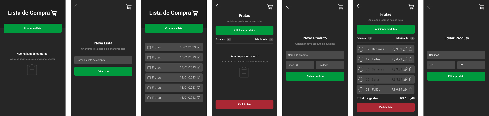

# Aplicativo de lista de compra
## Para instalar as dependências
- npm install

## Para iniciar o projeto
- expo start

- Precione a se for usar no emulador.

- E use QR Code no caso de espelhar no seu celular com o aplicativo expo go.

 

